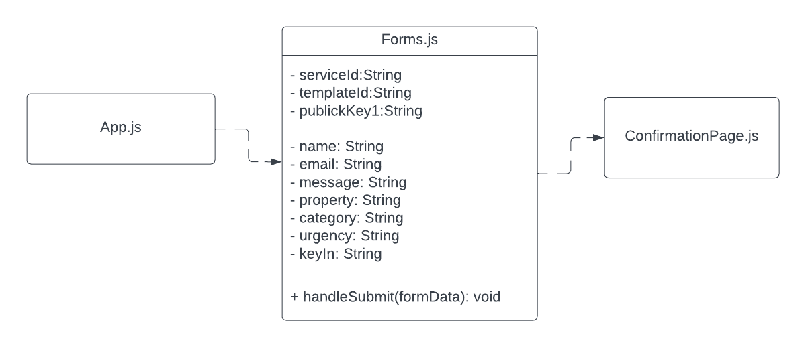

# Developer Documentation

## HRDC Maintenance Portal

---

## How to Obtain Source Code:

- Our code will be available at the following GitHub link: [HRDC Maintenance Portal Repository](https://github.com/423s24/Group_4)

## Planned Directory Structure:

- The directory structure will follow the typical React framework structure with components, etc.

## Planned Builds:

- React
- NPM packages
- The rest will be TBD...

## Developer Testing:

- We will ensure a placeholder webpage compiles without error.
- Unit tests will be written.

## Automated Build and Test:

- Continuous Integration will be implemented.

## How to Release a Version:

- We will define individual goals for each sprint and categorize them as either minor updates or patches, depending on the scope.
- We are using the standard version notation of Major.Minor.Patch, with the final release of our website being the first major update.

## Bug Tracker:

- We will use the Issues tab in the GitHub repository to manage and track current bugs.

## Comments in Source Code:

- Pull requests will outline changes to the code base in a short summary describing what they add or change in the product.
- In the code, ensure that code is properly explained in a short comment if a chunk of code does not have clear functionality when reading at first glance. Functions should have a brief description of what they do.

---

## UML Class Diagram:
HRDC’s goal is to have a simple and robust maintenance request form that anyone can fill out regardless of age and ability. We rationalize our minimalism through the goals of HRDC. This simple UML class diagram demonstrates how each component interacts with one another. React uses App.js as the foundational root. By running the React app, App.js will launch Forms.js, where users will input their contact information such as name and message. The message will be sent by using the EmailJS API using serviceId, templateId, and publicKey1 as fields. Once the “submit” button is pressed, the user will be redirected to ConfirmationPage.js where they will receive a “Thank you! Your form has been sent, we will get back to you as soon as possible.”. The confirmation page is the final step of the process.